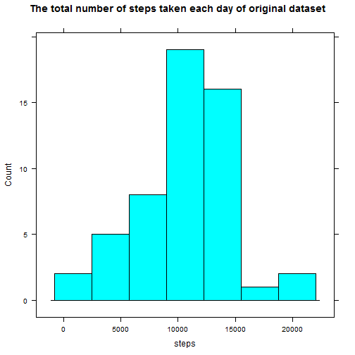
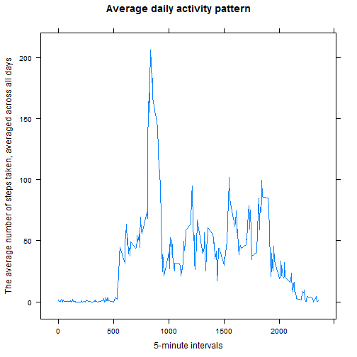
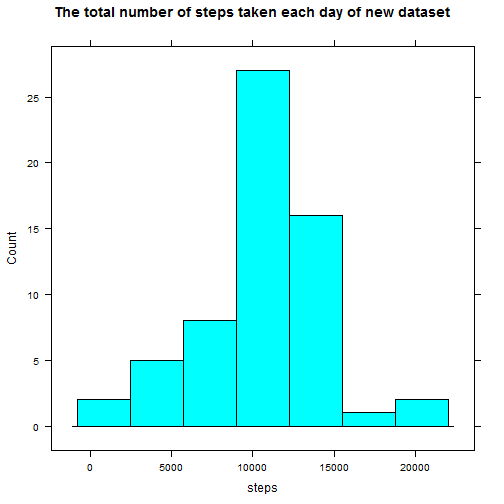
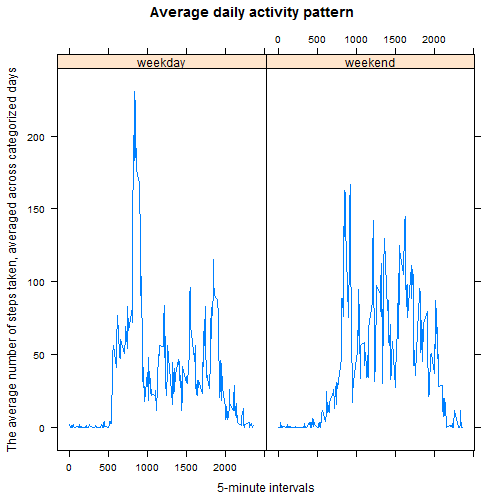

# Reproducible Research: Peer Assessment 1


## Loading and preprocessing the data

### Loading the data

```r

data <- read.csv(unz("C:/Courses/R/RepData_PeerAssessment1/activity.zip", "activity.csv"), 
    header = TRUE, sep = ",")
```

### Examining the data

```r
head(data)
```

```
##   steps       date interval
## 1    NA 2012-10-01        0
## 2    NA 2012-10-01        5
## 3    NA 2012-10-01       10
## 4    NA 2012-10-01       15
## 5    NA 2012-10-01       20
## 6    NA 2012-10-01       25
```

```r
str(data)
```

```
## 'data.frame':	17568 obs. of  3 variables:
##  $ steps   : int  NA NA NA NA NA NA NA NA NA NA ...
##  $ date    : Factor w/ 61 levels "2012-10-01","2012-10-02",..: 1 1 1 1 1 1 1 1 1 1 ...
##  $ interval: int  0 5 10 15 20 25 30 35 40 45 ...
```

```r
summary(data)
```

```
##      steps               date          interval   
##  Min.   :  0.0   2012-10-01:  288   Min.   :   0  
##  1st Qu.:  0.0   2012-10-02:  288   1st Qu.: 589  
##  Median :  0.0   2012-10-03:  288   Median :1178  
##  Mean   : 37.4   2012-10-04:  288   Mean   :1178  
##  3rd Qu.: 12.0   2012-10-05:  288   3rd Qu.:1766  
##  Max.   :806.0   2012-10-06:  288   Max.   :2355  
##  NA's   :2304    (Other)   :15840
```


### Pre-processing the data


```r
data$date <- as.Date(data$date, "%Y-%m-%d")
```


## What is mean total number of steps taken per day?

### Make a histogram of the total number of steps taken each day  


```r
require(lattice)
```

```
## Loading required package: lattice
```

```r
totalNumStepsPerDay <- as.data.frame(tapply(data$steps, data$date, sum))

colnames(totalNumStepsPerDay) <- "steps"
head(totalNumStepsPerDay)
```

```
##            steps
## 2012-10-01    NA
## 2012-10-02   126
## 2012-10-03 11352
## 2012-10-04 12116
## 2012-10-05 13294
## 2012-10-06 15420
```

```r
histogram(~steps, type = "count", main = "The total number of steps taken each day of original dataset", 
    data = totalNumStepsPerDay)
```

 


### Calculate and report the mean and median total number of steps taken per day  


```r
meanTotalNumStepsPerDay <- mean(totalNumStepsPerDay$steps, na.rm = TRUE)
medianTotalNumStepsPerDay <- median(totalNumStepsPerDay$steps, na.rm = TRUE)
```


 The mean of the total number of steps taken per day is 10766.1886792453   
 The median of the total number of steps taken per day is 10765


## What is the average daily activity pattern?

### Make a time series plot (i.e. type = "l") of the 5-minute interval (x-axis) and the average number of steps taken, averaged across all days (y-axis)  


```r
intervalMean <- data.frame(avgStepsPerDay = tapply(data$steps, data$interval, 
    mean, na.rm = TRUE))

xyplot(avgStepsPerDay ~ as.numeric(rownames(intervalMean)), main = "Average daily activity pattern", 
    xlab = "5-minute intervals", ylab = "The average number of steps taken, averaged across all days", 
    data = intervalMean, type = "l")
```

 


### Which 5-minute interval, on average across all the days in the dataset, contains the maximum number of steps?  


```r
# The maximum number of steps of the 5-minute interval, on average across
# all the days in the dataset
maxIntervalMean <- intervalMean[which(intervalMean == max(intervalMean)), ]
```


The maximum number of steps on the 5-minute interval, on average across all the days is 835 interval, value of 206.1698

## Imputing missing values


```r
# Calculate the total number of rows with NAs
sum(is.na(data$steps))
```

```
## [1] 2304
```

```r

# Strategy for filling in all of the missing values in the dataset using the
# strategy of the mean of each interval. THis strategy is choosing because
# mean of the date brings missing values Calculate the mean of day
intPerDayMean <- tapply(data$steps, data$interval, mean, na.rm = TRUE)


meansOfInts <- as.numeric(as.character(intPerDayMean)[as.factor(data$interval)])

# Create a new dataset that is equal to the original dataset but with the
# missing data filled in.
newData <- data
# Assigns the value zero where the row index of 'step' has a missing value
# (NA)
newData[which(is.na(newData$steps)), "steps"] <- 0
newData$steps <- newData[, "steps"] + (is.na(data$steps) * meansOfInts)

# Make a histogram of the total number of steps taken each day
newTotalNumStepsPerDay <- as.data.frame(tapply(newData$steps, newData$date, 
    sum))
colnames(newTotalNumStepsPerDay) <- "steps"
histogram(~steps, type = "count", main = "The total number of steps taken each day of new dataset", 
    data = newTotalNumStepsPerDay)
```

 

```r

# Calculate the mean and median total number of steps taken per day
newMeanTotalNumStepsPerDay <- mean(newTotalNumStepsPerDay$steps, na.rm = TRUE)
newMedianTotalNumStepsPerDay <- median(newTotalNumStepsPerDay$steps, na.rm = TRUE)
```


The mean of the total number of steps taken per day for the new data set is  10766.1886792453  
The median of the total number of steps taken per day for the new data set is  10766.1886792453

 The median value is like the mean value.

### Examining the new data set (imputed values)

```r
str(newData)
```

```
## 'data.frame':	17568 obs. of  3 variables:
##  $ steps   : num  1.717 0.3396 0.1321 0.1509 0.0755 ...
##  $ date    : Date, format: "2012-10-01" "2012-10-01" ...
##  $ interval: int  0 5 10 15 20 25 30 35 40 45 ...
```

```r
summary(newData)
```

```
##      steps            date               interval   
##  Min.   :  0.0   Min.   :2012-10-01   Min.   :   0  
##  1st Qu.:  0.0   1st Qu.:2012-10-16   1st Qu.: 589  
##  Median :  0.0   Median :2012-10-31   Median :1178  
##  Mean   : 37.4   Mean   :2012-10-31   Mean   :1178  
##  3rd Qu.: 27.0   3rd Qu.:2012-11-15   3rd Qu.:1766  
##  Max.   :806.0   Max.   :2012-11-30   Max.   :2355
```


## Are there differences in activity patterns between weekdays and weekends?


```r

newData$Weekday <- format(newData$date, "%a")
newData$weekdaytype <- ifelse(newData$Weekday == "Sat" | newData$Weekday == 
    "Sun", "weekend", "weekday")

require(reshape2)
```

```
## Loading required package: reshape2
```

```r

meltNewData <- melt(newData, id = c("interval", "weekdaytype"), measure.vars = "steps")

dcastNewData <- dcast(meltNewData, interval + weekdaytype ~ variable, mean, 
    na.rm = TRUE)

xyplot(steps ~ interval | weekdaytype, main = "Average daily activity pattern", 
    xlab = "5-minute intervals", ylab = "The average number of steps taken, averaged across categorized days", 
    data = dcastNewData, horizontal = TRUE, type = "l")
```

 


